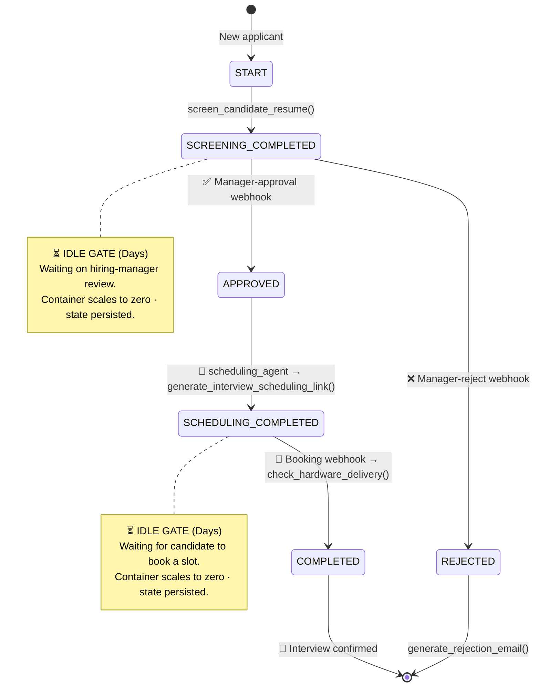
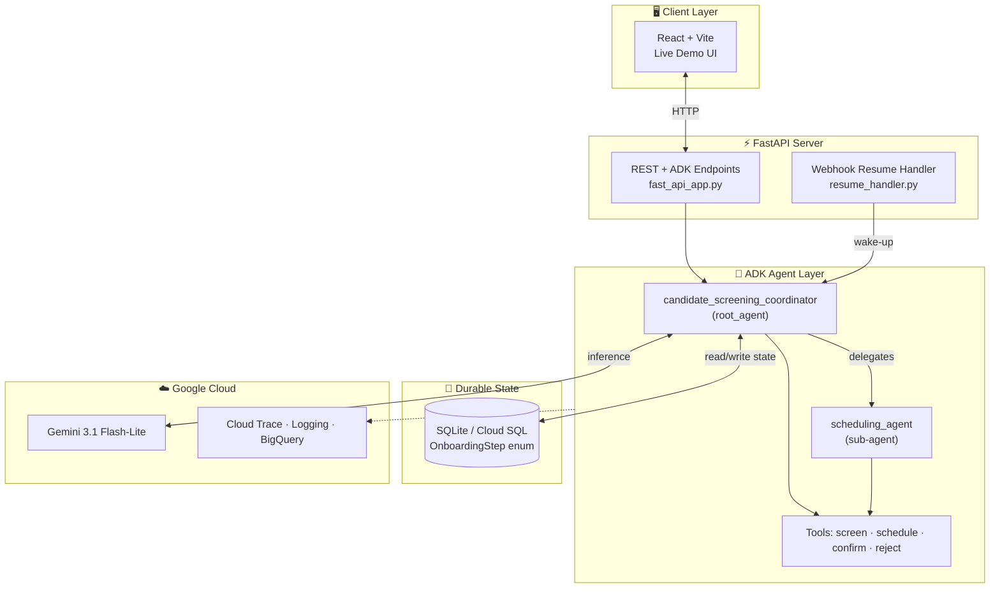
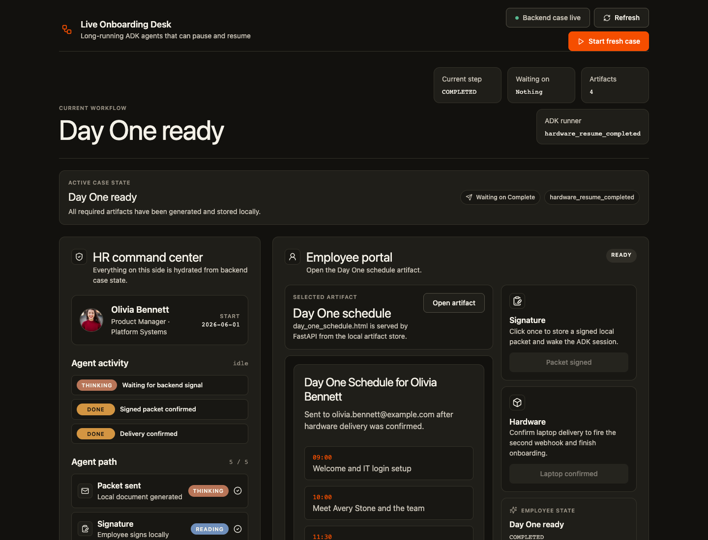

<div align="center">

# 🧑‍💼 Agentic HR — Long-Running Candidate Screening Agent

### A durable, multi-day AI hiring coordinator built on the Google Agent Development Kit (ADK)

[](https://www.python.org/)
[](https://google.github.io/adk-docs/)
[](https://ai.google.dev/)
[](https://fastapi.tiangolo.com/)
[](https://react.dev/)
[](LICENSE)

</div>

---

> **TL;DR** — Most "AI agents" are stateless chatbots that forget everything the moment a conversation pauses. **Agentic HR** is different: it's a *long-running* agent that screens candidates, waits **days** for a hiring manager's approval or a candidate's interview booking, sleeps at zero cost while it waits, and wakes up exactly where it left off — driven by webhooks, grounded in a strict state machine.

---

## 📑 Table of Contents

- [✨ What It Does](#-what-it-does)
- [🧠 The Core Idea: Architecting for Time](#-the-core-idea-architecting-for-time)
- [🔄 The Hiring State Machine](#-the-hiring-state-machine)
- [🏗️ System Architecture](#️-system-architecture)
- [🖥️ Live Demo UI](#️-live-demo-ui)
- [📂 Project Structure](#-project-structure)
- [⚙️ Prerequisites](#️-prerequisites)
- [🚀 Quickstart](#-quickstart)
- [🛠️ Developer Commands](#️-developer-commands)
- [📊 Evaluation Loop](#-evaluation-loop)
- [☁️ Deployment](#️-deployment)
- [🗺️ Roadmap & Milestones](#️-roadmap--milestones)
- [📡 Observability](#-observability)
- [📜 License](#-license)

---

## 🗺️ Roadmap & Milestones

Evolving into a **production-ready AI Recruitment Copilot**.

- [x] **Phase 1: Real Candidate Intelligence**
  - [x] Structured Pydantic schemas for Candidate Profiles and JDs.
  - [x] Grounded screening evaluation using Gemini Flash-Lite.
  - [x] Authoritative structured Screening Reports in session state.
  - [x] Human-in-the-loop decision gate: **Approve / Reject / Hold**.
  - [x] Multi-candidate concurrent pipeline support.
- [ ] **Phase 2: Real ATS Intake**
  - [ ] Automatic candidate arrival via webhooks (Greenhouse/Lever style).
  - [ ] Auto-creation of screening cases on application.
  - [ ] Pipeline dashboard showing all active cases, scores, and stages.
- [ ] **Phase 3: Intelligent, Empathetic Communication**
  - [ ] Personalized interview invitations and rejection feedback.
  - [ ] Recruiter approval queue for all outbound candidate mail.
  - [ ] Automated follow-ups for non-responders.
- [ ] **Phase 4: Decision Intelligence & Analytics**
  - [ ] Pipeline analytics (screened, approval rate, bottlenecks).
  - [ ] Plain-English event timelines for every agent action.
  - [ ] Pattern identification from manager overrides for prompt refinement.

---

## ✨ What It Does

**Agentic HR** is a multi-agent recruiting coordinator that walks every applicant through a structured hiring pipeline — screening, manager review, scheduling, and confirmation — without ever losing its place across multi-day delays.

| 🎯 Capability | 📝 Description |
| :--- | :--- |
| 📄 **Resume Screening** | Evaluates a candidate against the target role and generates a matching report. |
| ⏸️ **Manager Review Gate** | Durably pauses for a hiring manager to **Approve** or **Reject** — for days, at zero compute cost. |
| 🤝 **Multi-Agent Delegation** | The coordinator hands off interview scheduling to a dedicated `scheduling_agent` sub-agent. |
| 📅 **Interview Scheduling** | Generates a Calendly-style booking link and waits for the candidate to pick a slot. |
| 📨 **Rejection Handling** | Drafts and sends a polite rejection email for candidates who aren't moving forward. |
| 🔔 **Webhook Resume** | Wakes the dormant agent from external events (manager decision, slot booked) and resumes the reasoning chain. |

---

## 🧠 The Core Idea: Architecting for Time

Hiring isn't a single conversation — it unfolds over **days or weeks**. Naïve agents try to survive this by dumping raw chat history into a vector DB, which leads to context pollution, runaway token costs, and hallucinated reasoning.

This project takes the opposite approach with **three architectural paradigm shifts**:

| ❌ Stateless Chatbot Pattern | ✅ Durable Agent Pattern (This Repo) | 💡 Why It Matters |
| :--- | :--- | :--- |
| **Stateless memory** — dumps raw JSON logs into a vector DB | **Durable state schema** — grounded enums serialized to SQLite / Cloud SQL | Kills prompt pollution, token bloat & reasoning drift over multi-week waits |
| **Active polling** — keeps threads/loops alive, burning compute | **Event-driven dormancy gates** — scales to zero, resumed via webhooks | The agent sleeps at rest until a real-world event wakes it |
| **Monolithic agent** — every tool crammed into one prompt | **Multi-agent delegation** — coordinator delegates scheduling to a sub-agent | Keeps prompts targeted and preserves the logical reasoning chain |

---

## 🔄 The Hiring State Machine

The coordinator is grounded in a strict, enum-based [`OnboardingStep`](app/state_schema.py#L16) state machine. It never runs in a blocked thread — instead it parks at **⏳ idle-time gates** and is resumed by webhook callbacks.



### 🚦 Step-by-Step Flow

| # | State | 🎬 Action | 🔧 Tool / Handler |
| :-: | :--- | :--- | :--- |
| 1 | `START` | Collect candidate name, email & target role | [`screen_candidate_resume`](app/tools.py#L20) |
| 2 | `SCREENING_COMPLETED` | ⏸️ Pause for hiring-manager decision | [`receive_signed_documents_callback`](app/resume_handler.py#L36) |
| 3 | `APPROVED` | Delegate to scheduling sub-agent | [`scheduling_agent`](app/agent.py#L76) |
| 4 | `SCHEDULING_COMPLETED` | Generate booking link, await slot selection | [`generate_interview_scheduling_link`](app/tools.py#L49) |
| 5 | `COMPLETED` | Confirm booking & finalize | [`check_hardware_delivery`](app/tools.py#L76) · [`receive_hardware_delivery_callback`](app/resume_handler.py#L105) |
| — | `REJECTED` | Send polite rejection email | [`generate_rejection_email`](app/tools.py#L107) |

---

## 🏗️ System Architecture



---

## 🖥️ Live Demo UI

A production-style **React + Vite** cockpit (served by FastAPI) demonstrates the pause/resume behavior honestly — the UI never optimistically advances; it waits for the backend ADK turn to actually complete.



- 🧭 **HR command center** — backend case state, ADK activity, state-machine progress & event history.
- 👤 **Candidate portal** — review the screening packet, trigger manager review, and confirm booking.

Once the server is running, open 👉 **http://127.0.0.1:8000/live-onboarding/**

---

## 📂 Project Structure

```
agentic-hr/
├── 📁 app/                          # Core agent application
│   ├── 🐍 agent.py                  # Root coordinator + scheduling sub-agent + system prompt
│   ├── 🔧 tools.py                  # Screening, scheduling, confirmation & rejection tools
│   ├── 🗂️ state_schema.py           # OnboardingStep enum (the durable state machine)
│   ├── 🔔 resume_handler.py         # Webhook callbacks that wake & resume the agent
│   ├── 🖥️ live_onboarding.py        # Demo case state, artifact generation & API helpers
│   ├── ⚡ fast_api_app.py           # FastAPI server (agent + custom endpoints + static UI)
│   ├── ☁️ agent_runtime_app.py      # Reasoning Engine wrapper for Agent Runtime
│   ├── 📦 static/live-onboarding/   # Built React app served by FastAPI
│   └── 🛠️ app_utils/                # Telemetry & shared typing helpers
├── 📁 frontend/live-onboarding/     # React + Vite source for the demo UI
├── 📁 tests/                        # unit · integration · eval (golden sets)
├── 📄 pyproject.toml                # uv project + dependencies
├── 📄 .env.example                  # Copy to .env and add your key
└── 📄 README.md
```

---

## ⚙️ Prerequisites

| Tool | Purpose | Install |
| :--- | :--- | :--- |
| 🐍 **uv** | Fast Python package manager | [docs.astral.sh/uv](https://docs.astral.sh/uv/getting-started/installation/) |
| 🤖 **agents-cli** | Gemini Enterprise agent CLI (scaffold, playground, deploy) | `uv tool install google-agents-cli` |
| ☁️ **Google Cloud SDK** | Auth & deployment | [cloud.google.com/sdk](https://cloud.google.com/sdk/docs/install) |

---

## 🚀 Quickstart

```bash
# 1️⃣ Clone
git clone https://github.com/zackseal89/agentic-hr.git
cd agentic-hr

# 2️⃣ Configure credentials — pick ONE:
cp .env.example .env          # then paste your GEMINI_API_KEY
#   …or use Application Default Credentials:
gcloud auth application-default login
gcloud config set project <your-project-id>

# 3️⃣ Install dependencies
uv sync

# 4️⃣ Run the server + live demo UI
uv run uvicorn app.fast_api_app:app --host 127.0.0.1 --port 8000
```

Then open 👉 **http://127.0.0.1:8000/live-onboarding/**

> 🔁 Changed the React frontend? Rebuild the static assets:
> ```bash
> cd frontend/live-onboarding && npm install && npm run build
> ```
> The build writes directly into `app/static/live-onboarding`, which FastAPI serves.

---

## 🛠️ Developer Commands

| Command | 🎯 Purpose |
| :--- | :--- |
| `agents-cli install` | Install project dependencies via `uv` |
| `agents-cli playground` | Interactive local chat sandbox for the agent |
| `uv run uvicorn app.fast_api_app:app --host 127.0.0.1 --port 8000` | Run the FastAPI app + live UI |
| `cd frontend/live-onboarding && npm run build` | Build the React UI into `app/static` |
| `agents-cli lint` | Validate structure & formatting |
| `uv run pytest tests/unit` | Deterministic state & artifact tests |
| `uv run pytest tests/integration` | Streaming + E2E FastAPI tests |

---

## 📊 Evaluation Loop

State-machine transitions are validated with formal **golden evaluation sets**:

- 🧪 **Eval config** — [`tests/eval/eval_config.json`](tests/eval/eval_config.json)
- 📋 **Golden cases** — [`tests/eval/evalsets/`](tests/eval/evalsets/)

```bash
# Direct local runner (bypasses credential/conflict overrides)
.venv/bin/adk eval ./app tests/eval/evalsets/dead_time_delay_eval.json \
  --config_file_path tests/eval/eval_config.json
```

---

## ☁️ Deployment

```bash
# 1️⃣ Point at your project
gcloud config set project <your-project-id>

# 2️⃣ Deploy to Agent Runtime (Agent Engines)
agents-cli deploy

# 3️⃣ Add CI/CD or adapt infra
agents-cli scaffold enhance
```

**Agent Runtime** hosts the server, manages persistent sessions out of the box, and natively streams trace spans to **Cloud Trace** for real-time monitoring.

---

## 📡 Observability

Built-in telemetry (pre-configured in [`app/app_utils/telemetry.py`](app/app_utils/telemetry.py)) uses **OpenTelemetry** to export trace spans, API logs, and model-execution metadata to **Cloud Trace**, **Cloud Logging**, and **BigQuery**.

---

## 📜 License

Licensed under the **Apache License 2.0** — see [LICENSE](LICENSE) for details.

<div align="center">

---

⭐ **Star this repo** if the long-running agent pattern helped you · Built with 🤖 [Google ADK](https://google.github.io/adk-docs/) & ✨ [Gemini](https://ai.google.dev/)

</div>
